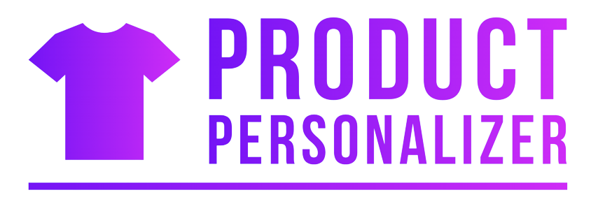
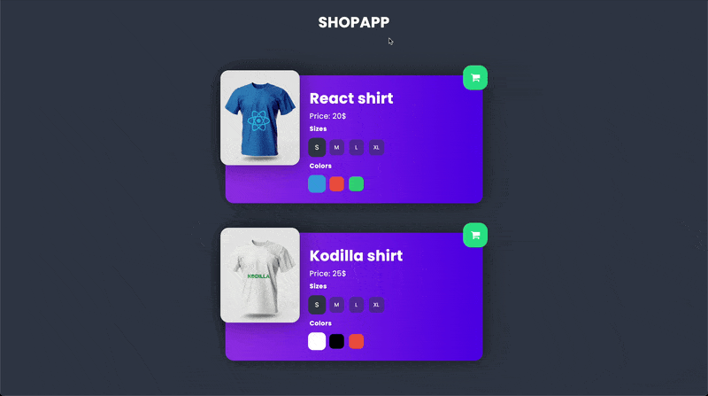

<a id="readme-top"></a>

<p align="center">
  <br>
 </a>
</p>

<h4 align="center">Product Personalizer App created as part of the Kodilla Bootcamp project. <br /> Website was developed using React component class definition, Prop-types and CLSX packages.

<br/>
<br/>

<p align="center">
  <a href="#demo">Demo</a> •
  <a href="#overview">Quick overview</a> •
  <a href="#languages">Languages&Tools</a> •
  <a href="#how-to-use">How To Use</a> •
  <a href="#contact">Contact</a>
</p>

<br />

<p align="center">
  
<p>

## 💻 <a id="demo">Demo :</a>

If you want check Product Personalizer App, it is deployed on Netlify. Just click link below :
<br />

https://roaring-cendol-70c630.netlify.app

<p align="right">(<a href="#readme-top">back to top</a>)</p>

## 🚀 <a id="overview">Quick overview :</a>

The Product Personalizer App is a single-page application developed using React component class definition. To create the app I additionally used :

- Prop-types package to document the intended types of properties passed to components,
- CLSX utility for constructing className strings conditionally and drop-in replacement for the classNames module.

The application allows you to personalize the ordered T-shirts. Changing product size updates the price of the product. Changing the color re-renders the T-shirt view to a color corresponding to the class of the clicked button. I used the React method - useMemo to block re-rendering T-shirt price only when the T-shirt size will be changed. In other words, the default behavior re-rendering the price of a T-shirt on color change has been disabled by using useMemo. After clicking the cart button, the summary of the order placed will be displayed in the form of console.table

<p align="right">(<a  href="#readme-top">back to top</a>)</p>

## 🛠️ <a id="languages">Languages & tools</a>

|                                                                   Language / Tool                                                                    | Description                                                                 |
| :--------------------------------------------------------------------------------------------------------------------------------------------------: | :-------------------------------------------------------------------------- |
|                                         | Language used for structuring and presenting content on the World Wide Web. |
|                                          | CSS pre-procesor that make writing CSS more powerful.                       |
|                 | Icon library instead of traditional image icons.                            |
|  | To create dynamically updating content.                                     |
|                                       | JavaScript library for building user interfaces based on components         |
|    | Used to start with project App.                                             |
|                                                                      PropTypes                                                                       | Runtime type checking for React component props.                            |
|                                                                       ShortId                                                                        | Creates short non-sequential unique ids.                                    |
|                                                                         Clsx                                                                         | Utility for constructing className strings conditionally.                   |

<p align="right">(<a href="#readme-top">back to top</a>)</p>

## 💾 <a id="how-to-use">How To Use :</a>

```bash
# Clone this repository
$ git clone https://github.com/iMdPd/reactProductPersonalizer.git

# Go into the repository
$ cd random/directory/reactToDoApp

# Install dependencies
$ yarn install

# Run the app
$ yarn start
```

<p align="right">(<a href="#readme-top">back to top</a>)</p>

## 🤙🏻 <a id="contact">Contact :</a>

> GitHub [@iMdPd](https://github.com/iMdPd)
